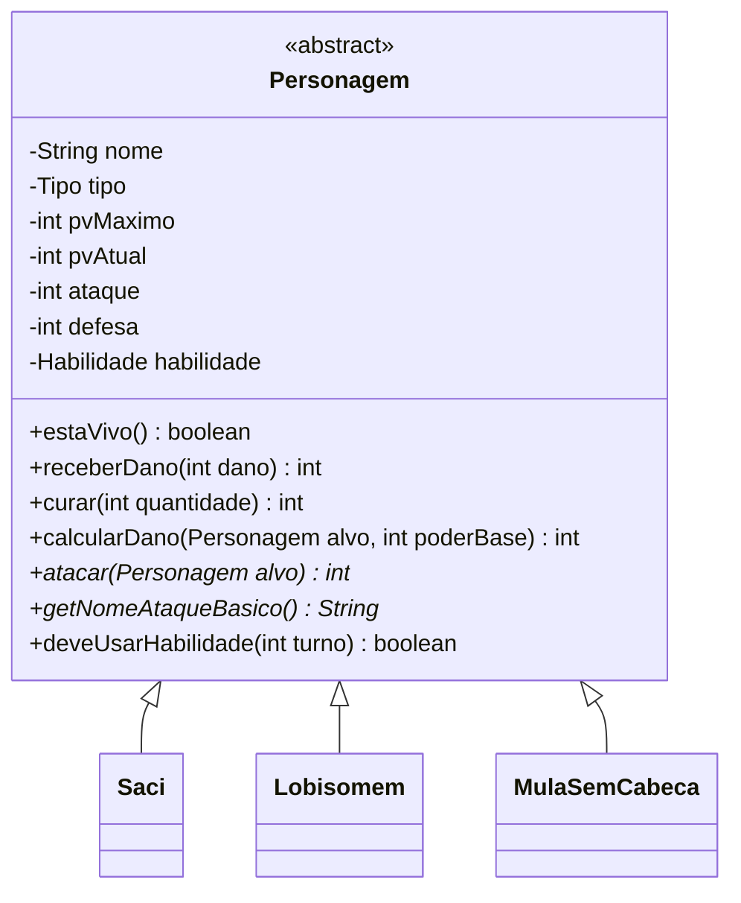
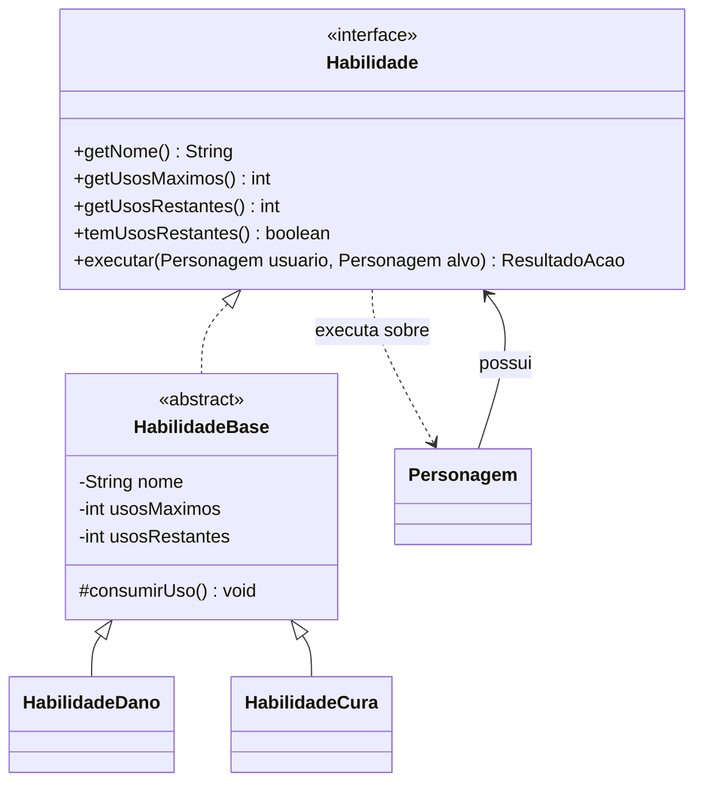
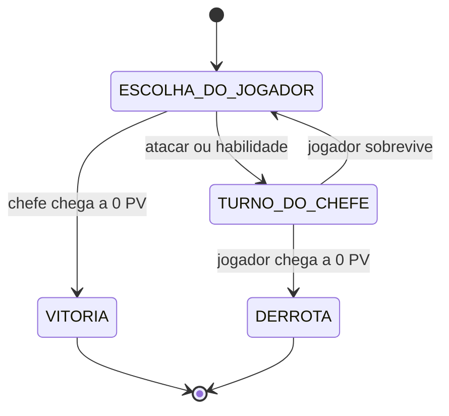
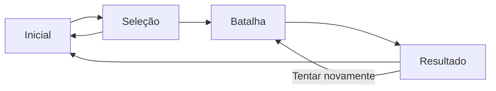

# Diagramas do MVP

Os diagramas abaixo representam as classes e os fluxos atualmente implementados.

## Personagens

```mermaid
classDiagram
    class Personagem {
        <<abstract>>
        -String nome
        -Tipo tipo
        -int pvMaximo
        -int pvAtual
        -int ataque
        -int defesa
        -Habilidade habilidade
        +estaVivo() boolean
        +receberDano(int dano) int
        +curar(int quantidade) int
        +calcularDano(Personagem alvo, int poderBase) int
        +atacar(Personagem alvo)* int
        +getNomeAtaqueBasico()* String
        +deveUsarHabilidade(int turno) boolean
    }

    class Saci
    class Lobisomem
    class MulaSemCabeca

    Personagem <|-- Saci
    Personagem <|-- Lobisomem
    Personagem <|-- MulaSemCabeca
```

## Habilidades

```mermaid
classDiagram
    class Habilidade {
        <<interface>>
        +getNome() String
        +getUsosMaximos() int
        +getUsosRestantes() int
        +temUsosRestantes() boolean
        +executar(Personagem usuario, Personagem alvo) ResultadoAcao
    }

    class HabilidadeBase {
        <<abstract>>
        -String nome
        -int usosMaximos
        -int usosRestantes
        #consumirUso() void
    }

    class HabilidadeDano
    class HabilidadeCura
    class Personagem

    Habilidade <|.. HabilidadeBase
    HabilidadeBase <|-- HabilidadeDano
    HabilidadeBase <|-- HabilidadeCura
    Personagem --> Habilidade : possui
    Habilidade ..> Personagem : executa sobre
```

## Estados da batalha

```mermaid
stateDiagram-v2
    [*] --> ESCOLHA_DO_JOGADOR
    ESCOLHA_DO_JOGADOR --> TURNO_DO_CHEFE: atacar ou habilidade
    ESCOLHA_DO_JOGADOR --> VITORIA: chefe chega a 0 PV
    TURNO_DO_CHEFE --> ESCOLHA_DO_JOGADOR: jogador sobrevive
    TURNO_DO_CHEFE --> DERROTA: jogador chega a 0 PV
    VITORIA --> [*]
    DERROTA --> [*]
```

## Fluxo das telas

```mermaid
flowchart LR
    Inicial --> Selecao[Seleção]
    Selecao --> Batalha
    Selecao --> Inicial
    Batalha --> Resultado
    Resultado --> Inicial
    Resultado -->|Tentar novamente| Batalha
```
